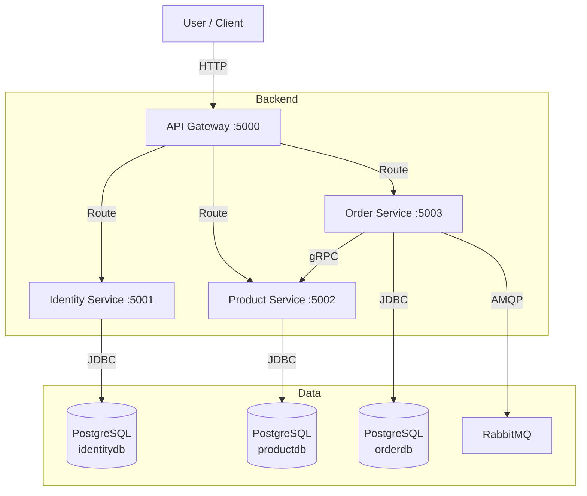
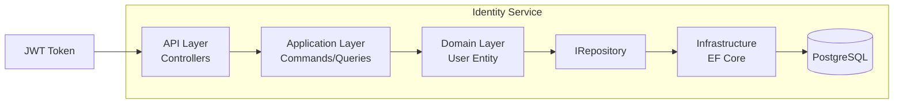
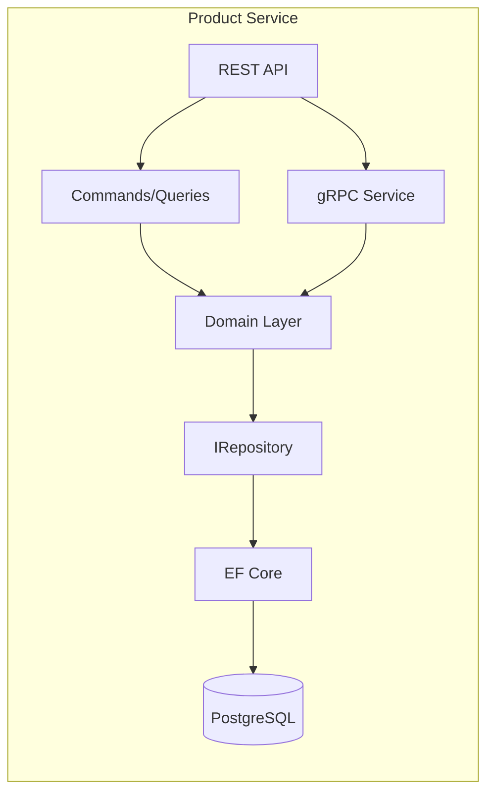
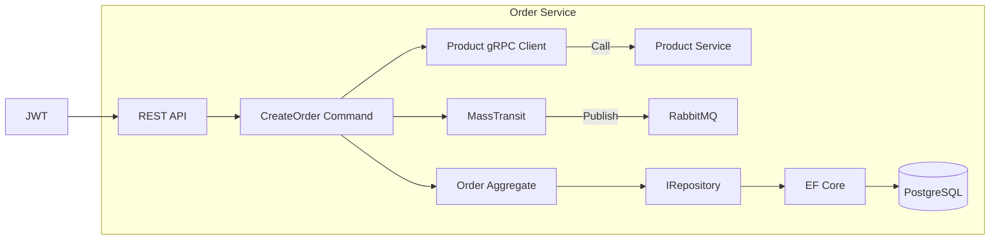

# 🎯 GIAI ĐOẠN 8: DOCUMENTATION

---

## Mục tiêu Phase này:
1. ✅ Tạo C4 Architecture Diagrams
2. ✅ Document API Contracts
3. ✅ Tạo Operation Runbook

---

## Bước 8.1: Tạo C4 Architecture Diagrams

### Mục đích:
- Trực quan hóa kiến trúc hệ thống
- Giúp hiểu rõ relationships giữa các components

### Cách làm:

**1. System Context Diagram (C4-Level 1):**

Tạo file `docs/architecture/c4-system-context.md`:

```markdown
# System Context Diagram

## Overview
Microservice Ecommerce là hệ thống thương mại điện tử phân tán với 4 services chính.

## Diagram



## Components

| Component | Technology | Responsibility |
|-----------|------------|----------------|
| API Gateway | YARP | Route, Auth validation |
| Identity Service | .NET 8 + JWT | Auth, User management |
| Product Service | .NET 8 + EF Core | Product catalog |
| Order Service | .NET 8 + MassTransit | Order processing |
| PostgreSQL | 16 | Database per service |
| RabbitMQ | 3.x | Message queue |
```

**2. Container Diagram (C4-Level 2):**

Tạo file `docs/architecture/c4-containers.md`:

```markdown
# Container Diagram

## Identity Service



| Container | Responsibility |
|-----------|----------------|
| Controllers | HTTP endpoints |
| Commands/Queries | MediatR handlers |
| User Entity | Business logic |
| Repository | Data access |
| EF Core | Database operations |

## Product Service



| Container | Responsibility |
|-----------|----------------|
| REST API | CRUD operations |
| gRPC Service | Inter-service calls |
| Domain Layer | Product, Category |
| IRepository | Data access |

## Order Service



| Container | Responsibility |
|-----------|----------------|
| REST API | Order endpoints |
| CreateOrder Command | Order workflow |
| Product gRPC Client | Call Product Service |
| MassTransit | Event publishing |
| Order Aggregate | Domain logic |
```

---

## Bước 8.2: Document API Contracts

### Mục đích:
- Liệt kê tất cả APIs với parameters, responses
- Giúp frontend developers hiểu contract

### Cách làm:

Tạo file `docs/architecture/api-contracts.md`:

```markdown
# API Contracts

## Base URL
```
Development: http://localhost:5000 (Gateway)
Production: http://gateway:80
```

## Authentication
- All protected endpoints require `Authorization: Bearer <token>`
- JWT token từ Identity Service `/api/auth/login`

---

## Identity Service

### POST /api/auth/register
**Description:** Register new user

**Request:**
```json
{
  "email": "user@example.com",
  "password": "Password123!",
  "confirmPassword": "Password123!"
}
```

**Response (201):**
```json
{
  "id": "guid",
  "email": "user@example.com",
  "message": "User registered successfully"
}
```

### POST /api/auth/login
**Description:** Login and get JWT token

**Request:**
```json
{
  "email": "user@example.com",
  "password": "Password123!"
}
```

**Response (200):**
```json
{
  "token": "eyJhbGciOiJIUzI1NiIs...",
  "expiresIn": 3600
}
```

---

## Product Service

### GET /api/products
**Description:** Get all products

**Response (200):**
```json
[
  {
    "id": "guid",
    "name": "Product Name",
    "description": "Description",
    "price": 100.00,
    "discountPrice": 90.00,
    "stockQuantity": 10,
    "imageUrl": "https://...",
    "categoryId": "guid",
    "sku": "SKU-ABC123"
  }
]
```

### GET /api/products/{id}
**Description:** Get product by ID

**Response (200):** Same as list item

**Response (404):** `{"error": "Product not found"}`

### POST /api/products
**Description:** Create new product (Admin only)

**Request:**
```json
{
  "name": "New Product",
  "description": "Description",
  "price": 100.00,
  "stockQuantity": 10,
  "categoryId": "guid",
  "sku": "SKU-NEW"
}
```

**Response (201):** Created product

### DELETE /api/products/{id}
**Description:** Soft delete product (Admin only)

**Response (200):** `true`

---

## Order Service

### POST /api/orders
**Description:** Create new order

**Headers:** `Authorization: Bearer <token>`

**Request:**
```json
{
  "shippingAddress": "123 Main St",
  "shippingPhone": "1234567890",
  "items": [
    {
      "productId": "guid",
      "quantity": 2
    }
  ]
}
```

**Response (201):**
```json
{
  "id": "guid",
  "userId": "user123",
  "userEmail": "user@example.com",
  "status": "Pending",
  "paymentStatus": "Pending",
  "totalAmount": 200.00,
  "shippingAddress": "123 Main St",
  "items": [...],
  "createdAt": "2024-01-01T00:00:00Z"
}
```

### GET /api/orders/{id}
**Description:** Get order by ID

**Headers:** `Authorization: Bearer <token>`

**Response (200):** Same as create response

**Response (404):** `{"error": "Order not found"}`

### GET /api/orders/my-orders
**Description:** Get current user's orders

**Headers:** `Authorization: Bearer <token>`

**Response (200):**
```json
[
  {
    "id": "guid",
    "status": "Confirmed",
    "totalAmount": 200.00,
    "createdAt": "2024-01-01T00:00:00Z"
  }
]
```

---

## gRPC Contracts

### ProductGrpc.GetProduct
**Request:**
```protobuf
message ProductRequest {
  string product_id = 1;
}
```

**Response:**
```protobuf
message ProductResponse {
  string id = 1;
  string name = 2;
  string description = 3;
  double price = 4;
  double discount_price = 5;
  int32 stock_quantity = 6;
  string sku = 7;
  bool is_valid = 8;
}
```

### ProductGrpc.ReduceStock
**Request:**
```protobuf
message StockReductionRequest {
  string product_id = 1;
  int32 quantity = 2;
}
```

**Response:**
```protobuf
message StockResponse {
  bool success = 1;
  string message = 2;
}
```

---

## Health Checks

| Service | URL | Expected Response |
|---------|-----|-------------------|
| Gateway | /health | `{"status":"Healthy"}` |
| Identity | /health | `{"status":"Healthy"}` |
| Product | /health | `{"status":"Healthy"}` |
| Order | /health | `{"status":"Healthy"}` |
```

---

## Bước 8.3: Tạo Operation Runbook

### Mục đích:
- Hướng dẫn vận hành hệ thống
- Troubleshooting common issues

### Cách làm:

Tạo file `docs/runbook/operation-runbook.md`:

```markdown
# Operation Runbook

## 🚨 Emergency Contacts

| Role | Name | Phone | Email |
|------|------|-------|-------|
| DevOps Lead | TBD | TBD | TBD |
| Backend Lead | TBD | TBD | TBD |

---

## 🏥 Health Monitoring

### Check Service Health
```bash
# Check all services via Gateway
curl http://localhost:5000/health

# Check individual services
curl http://localhost:5001/health  # Identity
curl http://localhost:5002/health  # Product
curl http://localhost:5003/health  # Order
```

### Check Docker Status
```bash
# List running containers
docker ps

# Check container logs
docker logs -f ecommerce_identity
docker logs -f ecommerce_product
docker logs -f ecommerce_order
docker logs -f ecommerce_gateway

# Check resource usage
docker stats
```

### Check Database
```bash
# Connect to PostgreSQL
docker exec -it ecommerce_postgres psql -U sa -d postgres

# List databases
\l

# Connect to specific database
\c productdb

# List tables
\dt
```

### Check RabbitMQ
```bash
# Access RabbitMQ Management UI
# http://localhost:15672
# Username: guest
# Password: guest
```

---

## 🔧 Common Operations

### Restart a Service
```bash
# Restart specific service
docker-compose restart identity-service
docker-compose restart product-service
docker-compose restart order-service

# Or rebuild and restart
docker-compose up -d --build order-service
```

### View Logs
```bash
# Last 100 lines
docker logs --tail 100 ecommerce_order

# Follow logs in real-time
docker logs -f ecommerce_order

# Filter error logs
docker logs ecommerce_order 2>&1 | grep -i error
```

### Database Migration
```bash
# Run migration inside container
docker exec -it ecommerce_identity dotnet ef database update

# Or create new migration
docker exec -it ecommerce_identity dotnet ef migrations add MigrationName
```

### Scale Service
```bash
# Scale Order service to 3 instances
docker-compose up -d --scale order-service=3
```

---

## 🛠️ Troubleshooting

### Service Won't Start

**Symptoms:** Container exits immediately

**Diagnosis:**
```bash
# Check logs
docker logs ecommerce_identity

# Check if port is already in use
netstat -an | grep 5001
```

**Common Causes:**
- Port already in use → Change port in docker-compose.yml
- Database connection failed → Check ConnectionString
- Missing environment variables → Check docker-compose.yml

### Database Connection Failed

**Symptoms:** `Connection refused` or `Could not connect to server`

**Diagnosis:**
```bash
# Check PostgreSQL is running
docker ps | grep postgres

# Test connection
docker exec -it ecommerce_postgres pg_isready -U sa
```

**Solution:**
```yaml
# Add healthcheck to docker-compose
postgres:
  image: postgres:16-alpine
  healthcheck:
    test: ["CMD-SHELL", "pg_isready -U sa"]
    interval: 10s
    timeout: 5s
    retries: 5
```

### 504 Gateway Timeout

**Symptoms:** Request times out, returns 504

**Diagnosis:**
```bash
# Check if service is running
docker ps

# Check service logs
docker logs ecommerce_product
```

**Common Causes:**
- Service is down → Restart service
- Database query slow → Check database indexes
- gRPC call timeout → Check Product service is reachable

### JWT Token Invalid

**Symptoms:** 401 Unauthorized

**Diagnosis:**
```bash
# Check token expiry
# Decode JWT at https://jwt.io

# Check JWT settings match
echo $JWT_SECRET
```

**Solution:**
- Ensure JWT__Secret matches across all services
- Token expires after 1 hour (default)

### MassTransit/RabbitMQ Issues

**Symptoms:** Events not being published or consumed

**Diagnosis:**
```bash
# Check RabbitMQ queues
# Visit http://localhost:15672 → Queues

# Check Order service logs
docker logs ecommerce_order | grep -i rabbitmq
```

**Common Causes:**
- RabbitMQ not running → `docker-compose up -d rabbitmq`
- Connection string wrong → Check RabbitMQ__Host in environment

---

## 📊 Monitoring Dashboards

### Recommended Tools

| Tool | Purpose | URL |
|------|---------|-----|
| Grafana | Metrics visualization | http://localhost:3000 |
| Kibana | Log aggregation | http://localhost:5601 |
| RabbitMQ Monitor | Queue monitoring | http://localhost:15672 |

---

## 🔒 Security Checklist

- [ ] Change default passwords
- [ ] Use strong JWT secret (min 256-bit)
- [ ] Enable HTTPS in production
- [ ] Configure firewall rules
- [ ] Rotate database passwords regularly
- [ ] Review container capabilities

---

## 📋 Rollback Procedure

### If deployment fails:

```bash
# 1. Stop current deployment
docker-compose down

# 2. Rollback to previous version
git checkout <previous-commit-hash>

# 3. Rebuild and redeploy
docker-compose up -d --build
```

### If data corruption occurs:

```bash
# 1. Stop all services
docker-compose down

# 2. Restore from backup
docker volume backup

# 3. Start services
docker-compose up -d
```

---

## 📝 Change Log

| Date | Change | Author |
|------|--------|--------|
| 2024-01-01 | Initial runbook | System |
```

---

## ✅ CHECKLIST GIAI ĐOẠN 8

| Task | Mô tả | Status |
|------|-------|--------|
| 8.1 | C4 Architecture Diagrams | ⬜ |
| 8.2 | API Contracts documentation | ⬜ |
| 8.3 | Operation Runbook | ⬜ |

---

## 🎉 HOÀN THÀNH PROJECT!

Bạn đã triển khai xong toàn bộ Microservice Ecommerce project!

### Tổng kết các Phase đã hoàn thành:

| Phase | Nội dung | Status |
|-------|----------|--------|
| Phase 1 | Foundation (Docker + PostgreSQL) | ✅ |
| Phase 2 | Building Blocks (Core abstractions) | ✅ |
| Phase 3 | Identity Service | ✅ |
| Phase 4 | API Gateway (YARP) | ✅ |
| Phase 5 | Product Service + gRPC | ✅ |
| Phase 6 | Order Service + Saga | ✅ |
| Phase 7A | Fix Gateway, MassTransit, Polly | ⬜ |
| Phase 7B | Unit Tests, Serilog, README | ⬜ |
| Phase 7 | Docker + CI/CD | ⬜ |
| Phase 8 | Documentation | ⬜ |

### Kiến trúc hoàn chỉnh:

```
                    ┌──────────────┐
                    │   Gateway    │ :5000 (YARP + JWT)
                    └──────┬───────┘
                           │
    ┌──────────────────────┼──────────────────────┐
    │                      │                      │
┌───▼────┐          ┌────▼─────┐          ┌────▼──────┐
│Identity│          │ Product  │          │   Order   │
│ :5001  │          │  :5002   │          │   :5003   │
│  JWT   │          │  gRPC    │          │  gRPC     │
└───┬────┘          └────┬──────┘          └────┬──────┘
    │                    │                      │
    ▼                    ▼                      ▼
┌─────────┐       ┌───────────┐       ┌─────────────┐
│PostgreSQL│       │PostgreSQL│       │ PostgreSQL  │
│identity │       │ product  │       │   order     │
└─────────┘       └───────────┘       └─────────────┘
                                            │
                                      ┌─────▼─────┐
                                      │ RabbitMQ  │
                                      │MassTransit│
                                      └───────────┘
```

### Technologies sử dụng:

| Component | Technology |
|-----------|------------|
| Framework | .NET 8.0 |
| API Gateway | YARP |
| Database | PostgreSQL 16 |
| ORM | Entity Framework Core 8 |
| Message Queue | RabbitMQ 3 + MassTransit 7.1.5 |
| Auth | JWT + BCrypt |
| Logging | Serilog (Console + File) |
| Resilience | Polly |
| gRPC | Protobuf |
| CI/CD | GitHub Actions |
| Container | Docker + Docker Compose |
| Testing | xUnit + Moq |

---

**Cảm ơn bạn đã theo dõi! Chúc mừng bạn đã hoàn thành project!** 🎉